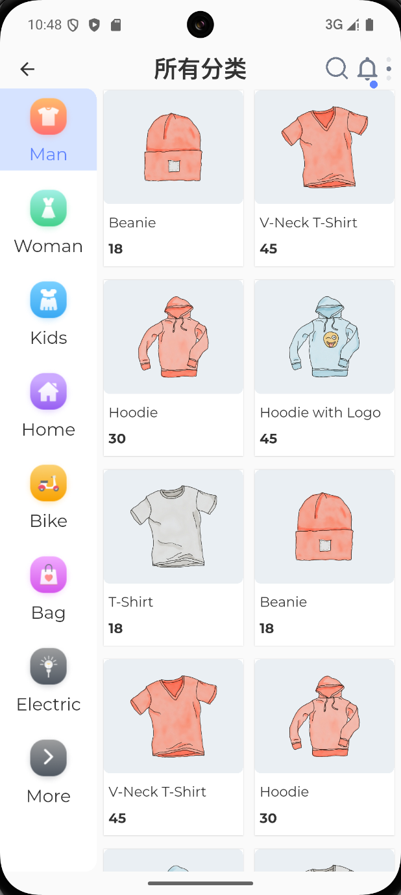
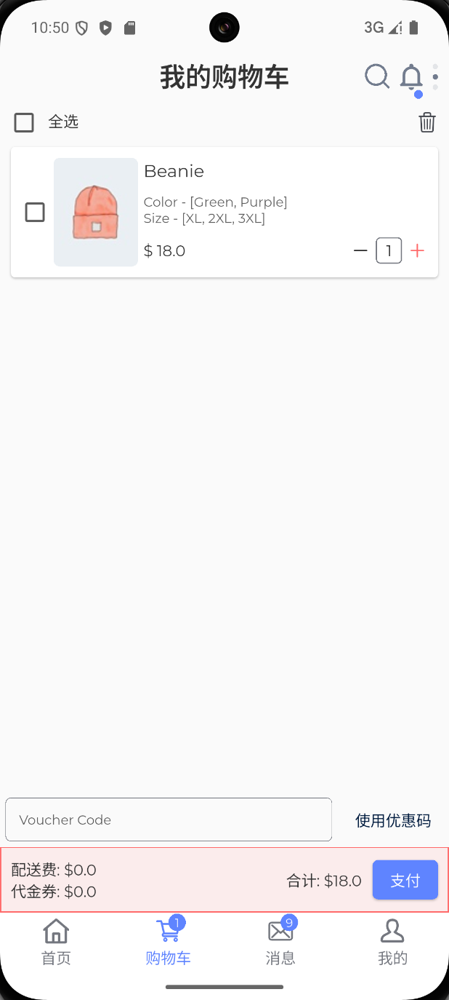
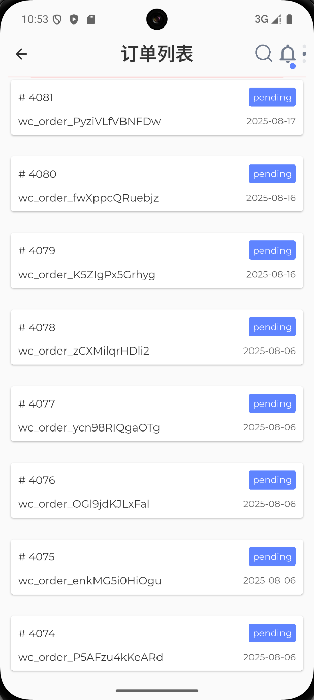
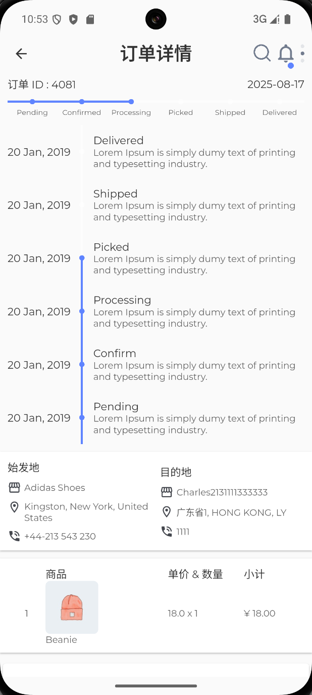
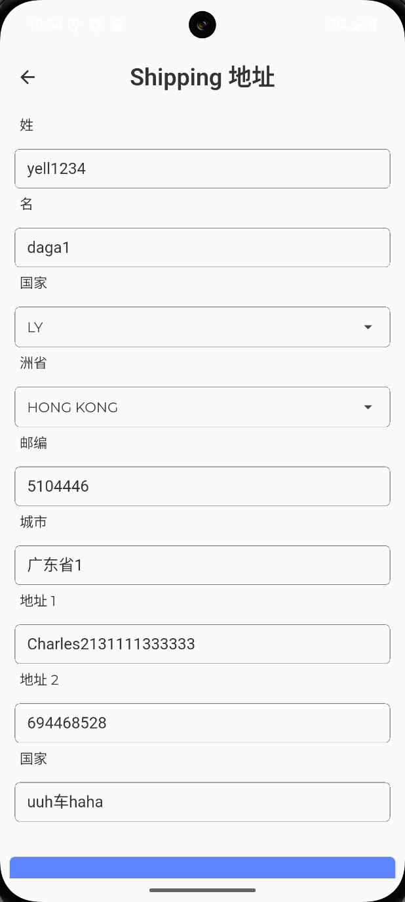

# Woo - Flutter 电商应用

一个基于 Flutter 开发的现代化电商移动应用，提供完整的购物体验。

## 应用截图

### 📱 主要界面展示

<div align="center">

| 首页 | 商品分类 | 商品详情 | 购物车 |
|:---:|:---:|:---:|:---:|
|  |  |  |  |

| 用户登录 | 用户注册 | 个人中心 | 商品搜索 |
|:---:|:---:|:---:|:---:|
|  |  |  |  |

| 订单列表 | 订单详情 | 地址管理 | 支付成功 |
|:---:|:---:|:---:|:---:|
|  |  |  |  |

</div>

### 🎯 核心功能演示

- **商品浏览**: 支持分类筛选、商品详情查看
- **购物流程**: 从商品选择到订单完成的完整流程
- **用户系统**: 注册登录、个人信息管理
- **订单管理**: 订单创建、状态跟踪、历史查看
- **地址管理**: 收货地址和账单地址管理

## 项目特性

### 🛍️ 核心功能

- **商品浏览**: 支持商品分类、搜索、详情查看
- **购物车管理**: 添加商品、数量调整、价格计算
- **用户系统**: 注册登录、个人资料管理
- **地址管理**: 收货地址的增删改查
- **订单系统**: 订单创建、状态跟踪、历史记录
- **支付集成**: 多种支付方式支持

### 🎨 用户体验

- **多语言支持**: 中英文切换
- **主题切换**: 明暗主题模式
- **响应式设计**: 适配不同屏幕尺寸
- **流畅动画**: 优雅的页面转场效果

### 🏗️ 技术架构

- **状态管理**: GetX 框架
- **路由管理**: GetX 路由系统
- **本地存储**: SharedPreferences
- **网络请求**: HTTP 客户端
- **图片处理**: 缓存和优化

## 项目结构

```
lib/
├── common/                 # 公共模块
│   ├── api/               # API接口
│   ├── components/        # 公共组件
│   ├── i18n/             # 国际化
│   ├── models/           # 数据模型
│   ├── routers/          # 路由配置
│   ├── services/         # 服务层
│   ├── style/            # 样式主题
│   ├── utils/            # 工具类
│   ├── values/           # 常量配置
│   └── widgets/          # 通用组件
├── pages/                 # 页面模块
│   ├── cart/             # 购物车
│   ├── goods/            # 商品相关
│   ├── my/               # 个人中心
│   ├── search/           # 搜索功能
│   └── system/           # 系统页面
├── global.dart           # 全局配置
└── main.dart             # 应用入口
```

## 环境要求

- **Flutter**: >= 3.0.0
- **Dart**: >= 2.17.0
- **Android**: API 21+ (Android 5.0+)
- **iOS**: 11.0+

## 安装与运行

### 1. 克隆项目

```bash
git clone <repository-url>
cd woo
```

### 2. 安装依赖

```bash
flutter pub get
```

### 3. 运行应用

```bash
# 调试模式
flutter run

# 发布模式
flutter run --release
```

### 4. 构建 APK

```bash
# Debug版本
flutter build apk --debug

# Release版本
flutter build apk --release
```
